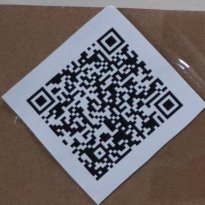
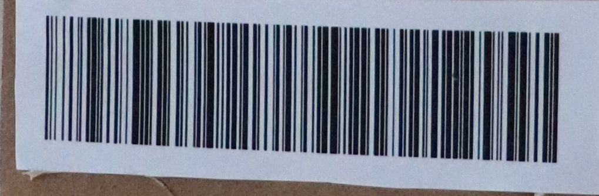

# Bitcoin wallet (1)

## Zadání

Hi, promising candidate,

the cleaning drones have taken pictures of some abandoned unknown package in our backup depot. The AI claims that the analysed item is in no way a package, instead it repeats "cat - animal - dangerous - avoid".

Get as much as possible information about the package.

Download [taken pictures](unknown_package.zip) (MD5 checksum `c6f700e1217c0b17b7d3a35081c9fabe`).

May the Packet be with you!

## Nápovědy (Hints)

1\. Machines prefer some sort of codes instead of plain texts.

## Řešení

Ve staženém archivu jsou dva soubory, jeden z nich (`unknown_package_2261_2.JPG`) obsahuje QR kód a několik čarových kódů. Pro čtení kódů je možné využít stránku <https://zxing.org/w/decode.jspx>

QR kód



obsahuje text:

```text
Mr. Erwin Rudolf Josef Alexander Schrodinger
CESNET, a.l.e.
Zikova 4
Prague 6
160 00
```

Čarový kód



obsahuje hledaný flag, další kódy není potřeba zkoumat.

## Flag

`FLAG{Oics-NF3B-vUOC-pUMt}`
