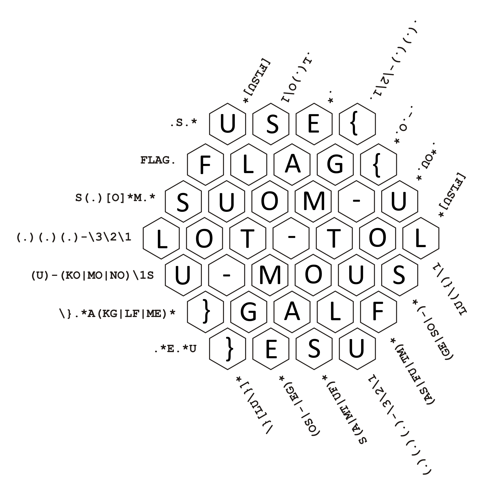

# Regex crossword (1)

## Zadání

Hi, promising candidate,

you have to prove the knowledge of regular expressions. Our Finnish recruiter Timo has prepared some crossword suitable for this purpose.

Download [task description](regex_crossword.zip) (MD5 checksum `6448c1748cc6047470a5f00c3945c1c4`).

May the Packet be with you!

## Nápovědy (Hints)

1\. <https://www.rexegg.com/regex-quickstart.html>

## Řešení

Ve staženém archivu je PDF soubor s křížovkou s regular expression pravidly. Nápověda obsahuje odkaz na popis regex pravidel. Křížovku jsem si vytiskl a ručně postupně vyplňoval tak, aby byla splněna regex pravidla.

## Flag

`FLAG{SUOM-ULOT-TOLU-MOUS}`
