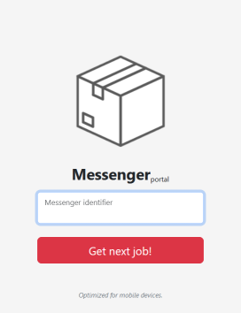
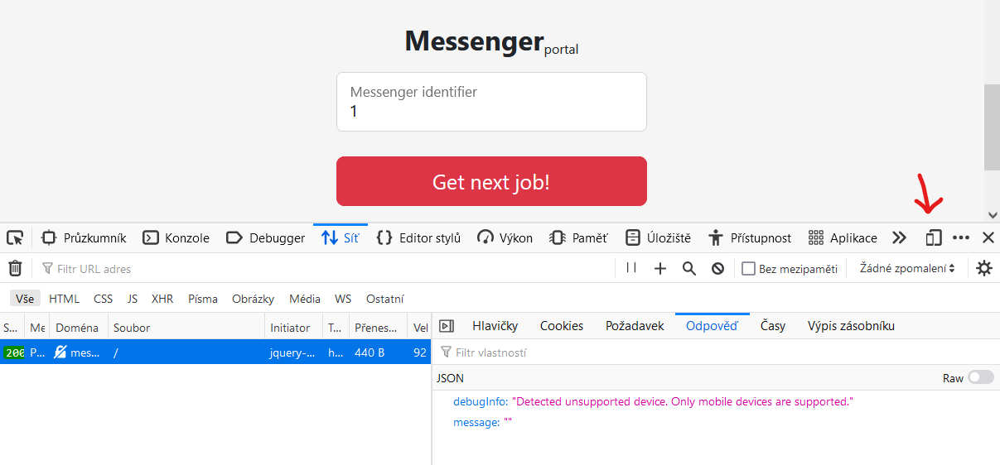
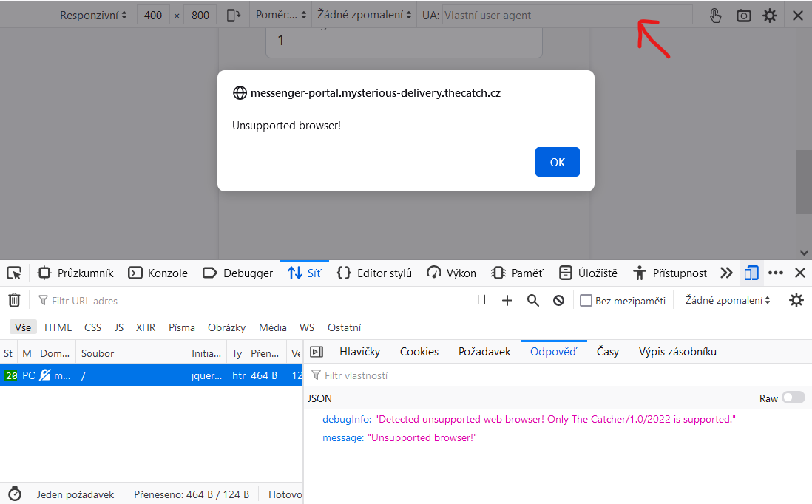

# Messenger portal (3)

## Zadání

Hi, packet inspector,

our messengers are dependent on aplication called Messenger portal when they are in the field. It allows to display various information they need to do their jobs on their special mobile devices.

Currently, the AI has installed new modern and fully responsive version of the Messenger portal – even the validation of messenger numeric ID is not implemented yet and the messengers report problem with displaying details of they deliveries.

You have to analyze the [Messenger portal](http://messenger-portal.mysterious-delivery.thecatch.cz) and find some way to get detail information about deliveries. Hurry, please, the packages are pilling up!

May the Packet be with you!

## Nápovědy (Hints)

1\. Messengers use special mobile devices.

## Řešení

Po otevření stránky <http://messenger-portal.mysterious-delivery.thecatch.cz> se zobrazí stránka se zadávacím polem.

Zkusíme uhádnout číslo zásilky a zadáme třeba 1. Po stisku tlačítka `Get next job!` se zdánlivě nic nestalo. Otevřeme vývojářskou konzoli prohlížeče (F12), zadáme znovu 1 a prozkoumáme síťovou komunikaci.

V odpovědi je vidět, že server požaduje mobilní zařízení. Zkusíme přepnout prohlížeč do emulace mobilního zařízení.

Po dalším zadání odpoví server další chybou:

`Detected unsupported web browser! Only The Catcher/1.0/2022 is supported.`

Vyžaduje tedy prohlížeč `The Catcher/1.0/2022`, který vyplníme do připraveného pole v emulátoru.

Po dalším zadání odpoví server další chybou:

`Detected unsupported OS! Only MessengerOS is supported.`

Změníme tedy typ prohlížeče na `The Catcher/1.0/2022 (MessengerOS)`.

Po dalším zadání by se již měla zobrazit stránka s vlajkou, ale nenačte se celá.

V logu prohlížeče se objevil výpis

`The loading of “http://messenger-portal.mysterious-delivery.thecatch.cz/?messenger-jobs” in a frame is denied by “X-Frame-Options“ directive set to “DENY“` [Zjistit více](https://developer.mozilla.org/en-US/docs/Web/HTTP/Headers/X-Frame-Options)

Problém je způsoben zákazem vložení jedné stránky do druhé pomocí HTML tagu `<iframe`. Zakázání se prohlížeči předá pomocí HTML hlavičky

`X-Frame-Options: DENY`.

Naštěstí exisuje např. pro Firefox doplněk <https://addons.mozilla.org/en-US/firefox/addon/ignore-x-frame-options-header>, který umožní tuto volbu ignorovat.

Po znovunačtení stránky se již zobrazí flag.

## Flag

`FLAG{CjJn-3bH6-xT9z-1wEE}`
