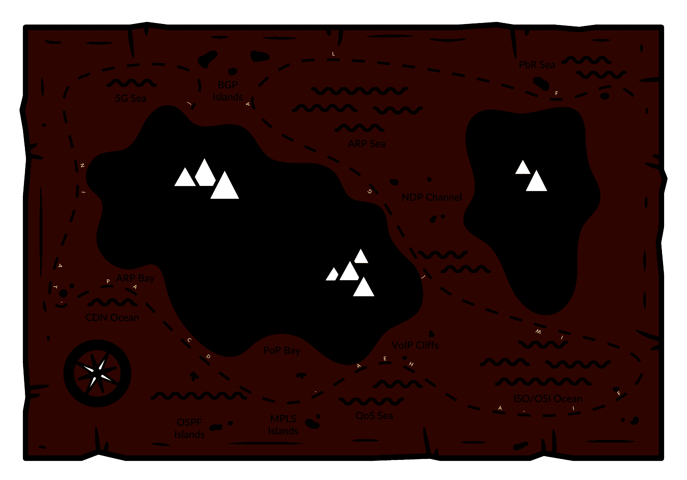

# Treasure map (1)

## Zadání

Ahoy, deck cadet,

working with maps and searching for treasures is every sailor's daily routine, right? Your task is to examine the map and find any hidden secrets.

May you have fair winds and following seas!

Download the [treasure map](treasure_map.zip).

(MD5 checksum: `4f0f6570025ded4d7823739bc963d85e`)

## Nápovědy (Hints)

1. Look for basic steganography tricks.

## Řešení

Stažený ZIP soubor obsahuje mapu. Úpravou jasu a kontrastu se objeví písmena na cestě.

## Flag

`FLAG{WIFI-AHEA-DCAP-TAIN}`
