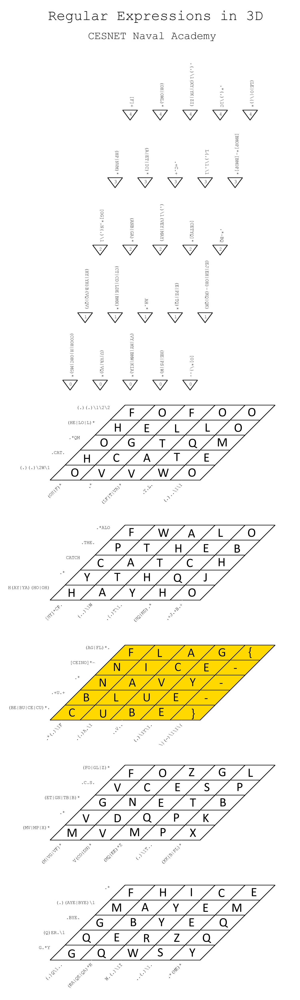

# Regular cube (2)

## Zadání

Ahoy, officer

knowledge of regular expressions is crucial for all sailors from CNS fleet. A 3D crossword puzzle is available to enhance this skill.

May you have fair winds and following seas!

Download the [regular cube crossword](regular_cube.zip).

(MD5 checksum: `e0fccb92b8c46b80e75e350503a528ff`)

## Nápovědy (Hints)

1. <https://www.rexegg.com/regex-quickstart.html>

## Řešení

Stažený ZIP soubor obsahuje křížovku u které je potřeba vyplnit jednotlivé řádky a sloupce tak, aby vyhovovaly zapsaným regulárním výrazům.

Postupným doplňováním nám vyjde

## Flag

`FLAG{NICE-NAVY-BLUE-CUBE}`
