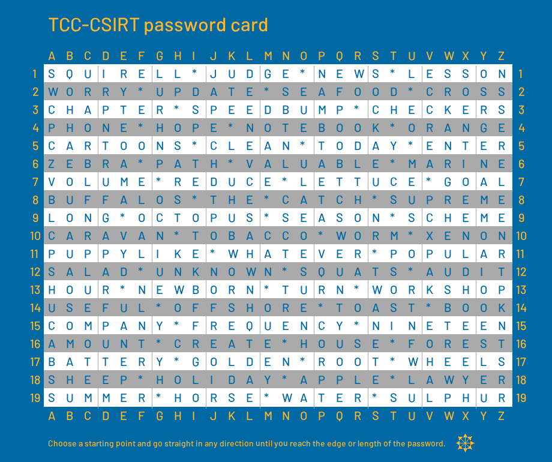

# Long secure password (3)

## Zadání

Hi, TCC-CSIRT analyst,

a new colleague came up with a progressive way of creating a memorable password and would like to implement it as a new standard at TCC. Each user receives a `TCC-CSIRT password card` and determines the password by choosing the starting coordinate, direction, and number of characters. For skeptics about the security of such a solution, he published the card with a challenge to log in to his SSH server.

Verify if the card method has any weaknesses by logging into the given server.

* [Download the password card](long_secure_password.zip) (sha256 checksum: `9a35dc6284c8bde03118321b86476cf835a3b48a5fcf09ad6d64af22b9e555ca`)
* The server has domain name `password-card-rules.cypherfix.tcc` and the colleagues's username is `futurethinker`.

See you in the next incident!

## Nápovědy (Hints)

1. The entropy is at first glance significantly lower than that of a randomly generated password.
1. We know that the colleague's favorite number is `18`, so it can be assumed that the password has this length as well.

## Řešení

Stažený ZIP soubor obsahuje šifrovací kartu pro vytváření hesel.


Hesla jsou tvořená tak, že se vybere místo v tabulce a pokračuje se vybraným směrem

* Vlevo
* Vpravo
* Nahoru
* Dolů
* Šikmo vlevo a nahoru
* Šikmo vpravo a nahoru
* Šikmo vpravo a dolů
* Šikmo vlevo a dolů

Díky nápovědě víme, že délka hesla je 18 znaků. Pro generování všech možných hesel využijeme program [PassGen.py](PassGen.py).

```python
table = ['SQUIRELL*JUDGE*NEWS*LESSON',
         'WORRY*UPDATE*SEAFOOD*CROSS',
         'CHAPTER*SPEEDBUMP*CHECKERS',
         'PHONE*HOPE*NOTEBOOK*ORANGE',
         'CARTOONS*CLEAN*TODAY*ENTER',
         'ZEBRA*PATH*VALUABLE*MARINE',
         'VOLUME*REDUCE*LETTUCE*GOAL',
         'BUFFALOS*THE*CATCH*SUPREME',
         'LONG*OCTOPUS*SEASON*SCHEME',
         'CARAVAN*TOBACCO*WORM*XENON',
         'PUPPYLIKE*WHATEVER*POPULAR',
         'SALAD*UNKNOWN*SQUATS*AUDIT',
         'HOUR*NEWBORN*TURN*WORKSHOP',
         'USEFUL*OFFSHORE*TOAST*BOOK',
         'COMPANY*FREQUENCY*NINETEEN',
         'AMOUNT*CREATE*HOUSE*FOREST',
         'BATTERY*GOLDEN*ROOT*WHEELS',
         'SHEEP*HOLIDAY*APPLE*LAWYER',
         'SUMMER*HORSE*WATER*SULPHUR']

passLen = 18
rows = 19
cols = 26

def AddToPass(pwd, row, col):
    if row >= 0 and row < rows:
        if col >= 0 and col < cols:
            return pwd + table[row][col]

def GenPass(rowDir, colDir):
    pwd = ''
    for i in range(passLen):
        pwd = AddToPass(pwd, row + i * rowDir, col + i * colDir)
        if pwd == None:
            return

    print(pwd)

for row in range(rows):
    for col in range(cols):
        GenPass( 0, -1) # Left
        GenPass( 0,  1) # Right
        GenPass(-1,  0) # Up
        GenPass( 1,  0) # Down

        GenPass(-1, -1) # Left + Up
        GenPass(-1,  1) # Rigth + Up
        GenPass( 1,  1) # Right + Down
        GenPass( 1, -1) # Left + Down
```

Program vypíše všech 518 možných hesel.

Ke zkoušení hesel použijeme aplikaci `hydra`.

`hydra -V -I -l futurethinker -P passList.txt password-card-rules.cypherfix.tcc ssh`

Po několika málo minutách je nalezeno platné heslo `SAOPUNUKTPHCANEMFW`.

Po přihlášení pomocí SSH je vypsán hledaný FLAG.

`ssh futurethinker@password-card-rules.cypherfix.tcc`

```text
Nobody will ever read this message anyway, because the TCC password card is super secure. Even my lunch access-code is safe here: FLAG{uNZm-GGVK-JbxV-1DIx}
```

## Flag

`FLAG{uNZm-GGVK-JbxV-1DIx}`
