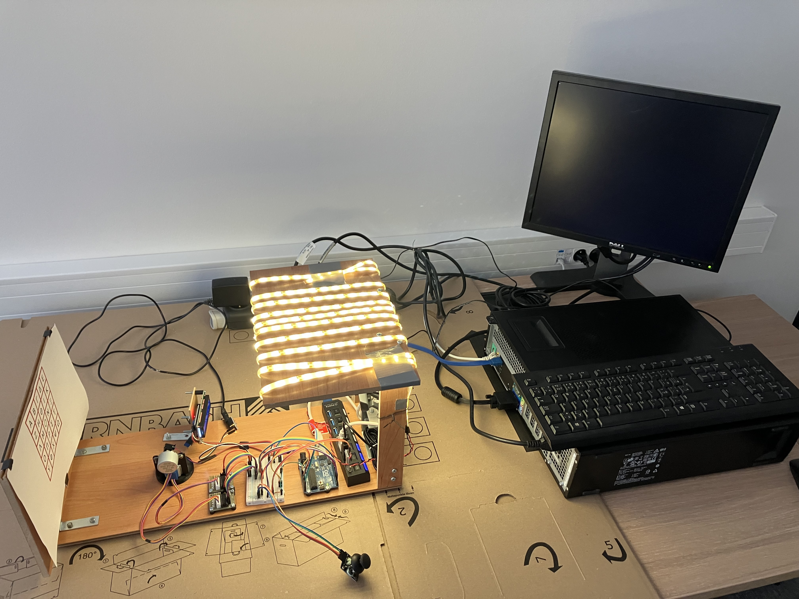
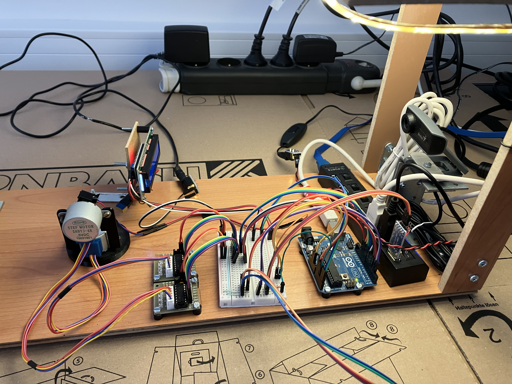
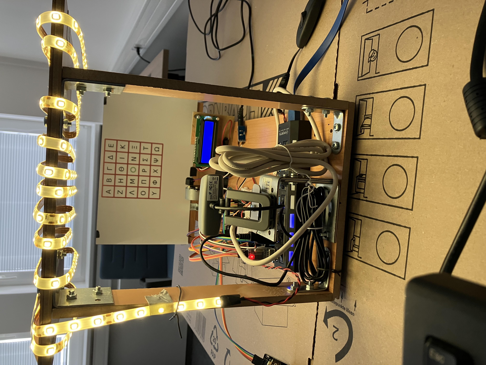
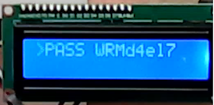
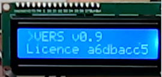
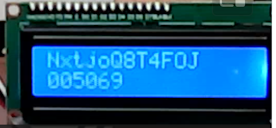
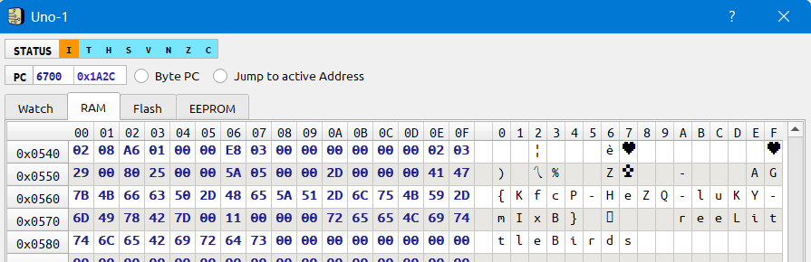
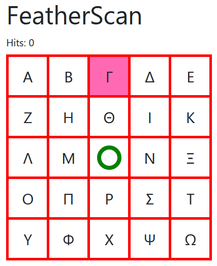
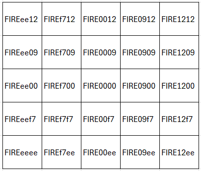

# Chapter

1. [Operator (2)](#chapter-1-operator-2)
1. [The Vendor (2)](#chapter-2-the-vendor-2)
1. [Open the door (5)](#chapter-3-open-the-door-5)
1. [Is not free (5)](#chapter-4-is-not-free-5)
1. [Hits (5)](#chapter-5-hits-5)

## Zadání

Hi, emergency troubleshooter,

recent studies suggest that the intense heat and hard labor of solar technicians often trigger strange, vivid dreams about the future of energetics. Over the past few days, technicians have woken up night after night with the same terrifying screams "Look, up in the sky! It’s a bird! It’s a plane! It’s Superman! Let’s roast it anyway!".

Find out what’s going on, we need our technicians to stay sane.

Stay grounded!

* <http://intro.falcon.powergrid.tcc/>

## Nápovědy (Hints)

1. Be sure you enter flag for correct chapter.

1. In this realm, challenges should be conquered in a precise order, and to triumph over some, you'll need artifacts acquired from others - a unique twist that defies the norms of typical CTF challenges.

1. Chapter haiku will lead you.

## Řešení

Všechny úlohy 1-5 mají stejné zadání a navazují na sebe. Stránka ze zadání obsahuje odkazy na jednotlivé kapitoly.

## Chapter 1: Operator (2)

Tato část odkazuje na stránku <http://roostguard.falcon.powergrid.tcc>

`dirb  http://roostguard.falcon.powergrid.tcc/`

```text
+ http://roostguard.falcon.powergrid.tcc/command (CODE:405|SIZE:153)
+ http://roostguard.falcon.powergrid.tcc/login (CODE:200|SIZE:2213)
+ http://roostguard.falcon.powergrid.tcc/logout (CODE:302|SIZE:199)
+ http://roostguard.falcon.powergrid.tcc/operator (CODE:200|SIZE:3783)
+ http://roostguard.falcon.powergrid.tcc/stats (CODE:200|SIZE:47)
```

Název kapitoly odkazuje na podstránku `operátor`. Stránka obsahuje online stream a možnost posílat příkazy

* Random password
* Firmware version
* Fire

Zdrojový kód stránky obsahuje také skrytý text s FLAGem

```html
<!-- debug only <div class="form-group"> <label for="raw_command">Raw command</label> <input type="text" class="form-control" id="raw_command" name="raw_command" placeholder="FLAG{AjQ6-NgLU-lQT7-XePG}"> </div> -->
```

## Chapter 2: The Vendor (2)

Tato část odkazuje na stránku <http://thevendor.falcon.powergrid.tcc>, kde běží systéme [XWiki](https://www.xwiki.org) ve verzi 16.4.0. Tato verze obsahuje chybu `CVE-2025-24893` umožňující vzdálené spuštění kódu. Použijeme tento exploit <https://github.com/dollarboysushil/CVE-2025-24893-XWiki-Unauthenticated-RCE-Exploit-POC> a spustíme si reverse shell.

V adresáři `/data/firmware` jsou soubory

[roostguard-firmware-0.9.bin](roostguard-firmware-0.9.bin) - soubor s firmware pro Arduino UNO

a fotky HW







FLAG je skrytý v proměnných prostředí

`set | grep FLAG`

## Chapter 3: Open the door (5)

Tato část odkazuje opět na stránku <http://roostguard.falcon.powergrid.tcc/>. V první kapitole úkolu byl vidět online stream, možnost posílat příkazy a také odkaz na přihlašovací stránku, kde se zobrazí `Challenge` a je potřeba zadat `Passcode`.

Při odeslání příkazu `Random password` se odešle command `PASS` a za chvíli se na displeji zobrazí



Při odeslání příkazu `Firmware version` se odešle command `VERS` a za chvíli se na displeji  zobrazí



Při odeslání příkazu `Fire` se odešle command `FIRE0000`, ale vypíše se chyba `authentication required`.

Firmware obsahuje tato zajímavá slova

```text
VERS
AIMM
LASE
TURR
DEMO
TEXT
PASS
HOTP
```

`HOTP` zřejmě znamená algoritmus pro generování jednorázových hesel (OTP).

Když tedy zkusíme odeslat HOTP doplněným Challenge z přihlašovací stránky, tedy např. `HOTPNxtjoQ8T4FOJ`, tak se na displeji za chvíli objeví



Když použijeme `005069` jako Passcode, tak dojde k přihlášení a zobrazení FLAGu.

Pro HOTP je použita knihovna [SimpleHOTP](https://github.com/jlusPrivat/SimpleHOTP) a v pythonu se výpočet dá zapsat jako

```python
import base64
import pyotp

challenge = b'NxtjoQ8T4FOJ'
hotpSecretPadding = b'abcdefghijklmnop'
prefix = b'HOTP'

print(pyotp.HOTP(base64.b32encode(prefix + challenge + hotpSecretPadding)).at(0))
```

## Chapter 4: Is not free (5)

Tato část odkazuje na stránku <http://thevendor.falcon.powergrid.tcc/#firmware>, takže bude potřeba více analyzovat firmware. Tato a další kapitola vyžadují detailní analýzu a reverse engineering získaného firmware nebo jeho simulaci. Některé simulátory jsou zdarma, některé placené ([Proteus](https://www.labcenter.com)). Využil jsem nástroj zdarma [SimulIDE Circuit Simulator](https://simulide.com/).

Je možné v něm vytvořit a simulovat celý HW včetně programu v Arduinu, UART rozhraní, I2C, displeje i krokových motorů. Z předchozích kapitol jsou k dispozici snímky celého HW, takže překreslené a funkční to vypadá takto.

<video controls>
  <source src="FALCON.mp4" type="video/mp4">
  Your browser does not support the video tag.
</video>

[SimulideProject.zip](SimulideProject.zip)

Je potřeba převést firmware na formát HEX.

`objcopy -O ihex roostguard-firmware-0.9.bin roostguard-firmware-0.9.hex`

Je možné zadávat povely a sledovat odezvu.

Když se zadá povel `VERS` a simulace se pozastaví, tak v datové oblasti CPU zůstane FLAG (bez prvních dvou písmen)



Po pozdější analýze kódu se jedná o RC4 šifru

```python
from Crypto.Cipher import ARC4

key = '54687265654c6974746c654269726473' # ThreeLittleBirds
licenseNumber = '5A 15 33 9D E0 BA 71 21 CB 05 6A 8A CA 36 B2 99 0A FB 23 9A 17 C9 57 29 96'

key = bytearray.fromhex(key)
licenseNumber = bytearray.fromhex(licenseNumber)

cipher = ARC4.new(key)
print(cipher.decrypt(licenseNumber).decode())
```

## Chapter 5: Hits (5)

Poslední část odkazuje opět na <http://roostguard.falcon.powergrid.tcc/>. Z předchozích částí už jsme na stránce přihlášeni a v menu je položka `FeatherScan`, kde se zobrazí mřížka stejná, jako ve video streamu.



Na stránce `http://roostguard.falcon.powergrid.tcc/operator` je možné zadávat `Raw command`. Fire povel, který vysílá `FIRE0000` již funguje.

V simulátoru je možné ověřit, že při zadání povelu `AIMMXXYY`, kde XX a YY jsou dvě hex čísla dojde k přestavení krokových motorů.

XX je pro pohyb doprava a doleva v rozsahu -18..18 (0xee..0x12)

YY je pro pohyb nahoru a dolů v rozsahu -18..12 (0xee..0x0c)

Povely pro jednotlivé buňky tabulky



Po "trefení" třech zadaných polí se zobrazí FLAG.

Po skončení soutěže byl celý projekt zařízení FALCON zveřejněn na [https://github.com/bodik/bs1-falcon](https://github.com/bodik/bs1-falcon).

## Flag

Chapter 1: Operator - `FLAG{AjQ6-NgLU-lQT7-XePG}`

Chapter 2: The Vendor - `FLAG{gwNd-0Klr-lsMW-YgZU}`

Chapter 3: Open the door - `FLAG{ui6l-waQb-o3QH-69Y4}`

Chapter 4: Is not free - `FLAG{KfcP-HeZQ-luKY-mIxB}`

Chapter 5: Hits - `FLAG{dxOI-9Vrw-p4TK-DWuh}`
